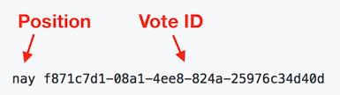

# Proof-of-Vote

### [**Liquid US**](https://liquid.us) uses special cryptography to allow public auditing of the vote record.

This system, known as **Proof-of-Vote**:

1. Allows anyone to verify that their vote is entered correctly and not tampered with.
2. Allows anyone to independently tabulate all of the votes themselves.
3. Preserves individual voter privacy.

For every vote cast by a [verified person](https://liquid.us/get_started/verification) on Liquid, a record is published with the `Position` and a unique `Vote ID`.



## What are Vote IDs?

Vote IDs are UUIDs with the following properties:

- **Unique:** Every individual vote has its own unique ID.
- **Private:** Vote IDs reveal nothing about the identity of the voter.

## Are the votes ordered?
Yes, from oldest to newest.

If a vote is updated, the old vote is removed and a new vote is added at the bottom.

## Vote Watchers

[**Liquid**](https://liquid.us) allows you to change your vote, but this git repository makes it transparent when votes are updated.

### Help strengthen the legitimacy powering the Proof-of-Vote system.

Become an automatic mirror of this repository. Each new mirror helps to decentralize the ledger of all votes, providing a more trustworthy historical record.

### Instructions

1. [Fork](https://help.github.com/articles/fork-a-repo/#fork-an-example-repository) this repo in GitHub.

2. Clone your fork to your local machine.

  ```sh
  git clone https://github.com/{YOUR_FORK}/proof-of-vote.git && cd proof-of-vote
  ```

3. Install the automated [mirror script](/update-liquid-mirror.sh) to run every 30 minutes:

  ```sh
  ./install-cronjob.sh
  ```
